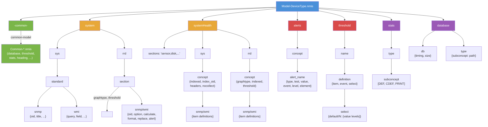
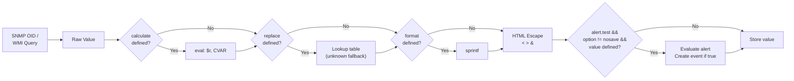
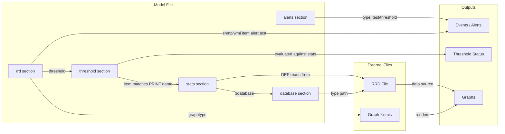
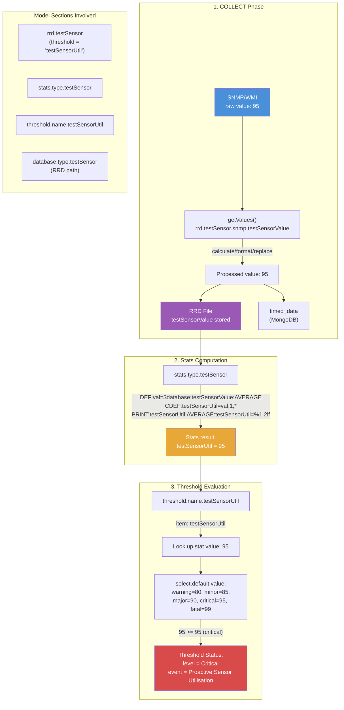
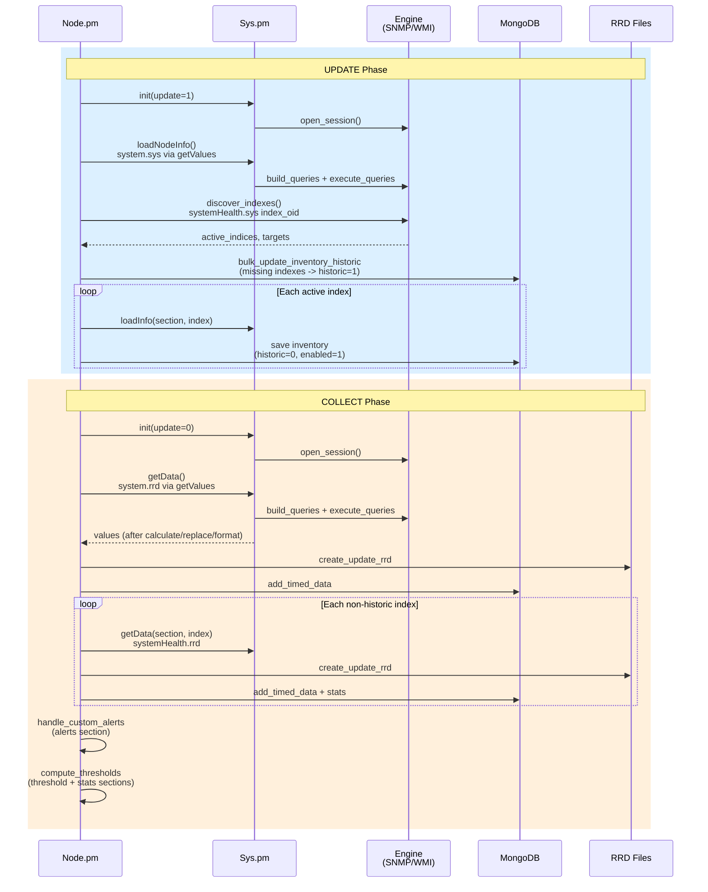

# NMIS9 Model Reference

This document describes every property recognized by NMIS9 device models (`.nmis` files).
Each property listed has been verified against the code that reads it, with source file and line references.

Properties found in existing models that have no code path are flagged as **unused/ignored**.

---

## 1. Model File Basics

- **Format**: Perl data structure (hash), evaluated via `eval`. Extension: `.nmis`
- **Location**: `models-default/` (shipped defaults), `models-custom/` (site-specific overrides)
- **Naming conventions**:
  - `Model-<DeviceType>.nmis` -- per-device-type model
  - `Common-<Name>.nmis` -- shared sections (merged into models via `-common-`)
  - `Graph-<Name>.nmis` -- RRD graph definitions
  - `Override-<Name>.nmis` -- global model overrides (loaded after common files)
- **Model selection**: determined by `sysObjectID` matching during node discovery
- **nodeModel**: set automatically from filename (`Model-TestSnmp.nmis` -> `TestSnmp`), overriding any `nodeModel` in the file itself (`Sys.pm:1681-1683`)

---

## 2. Top-Level Structure

```perl
%hash = (
    '-common-'     => { ... },  # References to Common-*.nmis files
    'system'       => { ... },  # Node-level data (sys + rrd)
    'interface'    => { ... },  # Interface collection (SNMP-only)
    'systemHealth' => { ... },  # Indexed health metrics
    'storage'      => { ... },  # Storage items
    'device'       => { ... },  # Device components
    'alerts'       => { ... },  # Custom alert definitions
    'threshold'    => { ... },  # Threshold policies
    'stats'        => { ... },  # RRD stats calculations (DEF/CDEF/PRINT)
    'heading'      => { ... },  # Graph display metadata
    'database'     => { ... },  # RRD file paths and timing/sizing
    'event'        => { ... },  # Event classification metadata
    'summary'      => { ... },  # Summary statistics
);
```

The top-level keys `system`, `interface`, `systemHealth`, `storage`, and `device` are **collection sections** -- they contain `sys` and/or `rrd` sub-sections with protocol-specific item definitions.

Other top-level keys (`alerts`, `threshold`, `stats`, `heading`, `database`, `event`, `summary`) are **support sections** -- they provide configuration consumed by specific subsystems.

### Model File Structure



---

## 3. The `-common-` Section

Declares which `Common-*.nmis` files to merge into this model.

```perl
'-common-' => {
    'class' => {
        'database'  => { 'common-model' => 'database' },   # loads Common-database.nmis
        'threshold' => { 'common-model' => 'threshold' },   # loads Common-threshold.nmis
        'heading'   => { 'common-model' => 'heading' },
        'stats'     => { 'common-model' => 'stats' },
        'event'     => { 'common-model' => 'event' },
        'summary'   => { 'common-model' => 'summary' },
    }
}
```

### Properties

| Property | Required | Description | Code Reference |
|----------|----------|-------------|----------------|
| `common-model` | Yes | Name suffix for the Common file to load (`'database'` loads `Common-database.nmis`) | `Sys.pm:1688` |

### Loading Behavior

- Common files are loaded in **alphabetical order** by class key name (`Sys.pm:1686`)
- Each is merged via `_mergeHash()` -- keys from common files are added; existing keys in the model take precedence (`Sys.pm:1699`)
- After all common files, **global override files** from config `global_model_overrides` are loaded as `Override-<name>.nmis` (`Sys.pm:1707-1726`)
- The merged model is cached to `<nmis_var>/nmis_system/model_cache/<model>.json` (`Sys.pm:1761-1764`)
- Cache is invalidated when any source file (model, common, config) has a newer mtime (`Sys.pm:1617-1660`)

---

## 4. Collection Sections

Each collection section (e.g., `system`, `systemHealth`) contains two sub-sections:

```perl
'system' => {
    'sys' => {                          # Info data (UPDATE phase)
        'standard' => {
            'snmp' => {
                'sysDescr' => { 'oid' => 'sysDescr', 'title' => 'Description' },
            }
        }
    },
    'rrd' => {                          # Time-series data (COLLECT phase)
        'mib2ip' => {
            'graphtype' => 'ip,fwd',
            'snmp' => {
                'ipInReceives' => { 'oid' => 'ipInReceives', 'option' => 'counter,0:U' },
            }
        }
    }
}
```

### `sys` -- Discovery/Info Data

- Collected during the **UPDATE** phase (`Node.pm: update_node_info`, `collect_systemhealth_info`)
- Data stored in inventory `data` field (MongoDB)
- Used for display, inventory path computation, and index discovery

### `rrd` -- Time-Series Data

- Collected during the **COLLECT** phase (`Node.pm: collect_node_data`, `collect_systemhealth_data`)
- Data stored in RRD files and `timed_data` MongoDB collections
- Used for graphing, threshold evaluation, and alerts

---

## 5. Section-Level Properties

These properties appear at the section level within `sys` or `rrd` blocks.

```perl
'systemHealth' => {
    'sections' => 'testSensor,testCalcOid',          # which sub-sections to collect
    'sys' => {
        'testSensor' => {
            'indexed'   => 'testSensorName',         # field used as index
            'index_oid' => '1.3.6.1.4.1.99999.1.1.1.2',  # OID to walk for discovery
            'headers'   => 'testSensorName,testSensorStatus',
            'snmp' => { ... }
        }
    },
    'rrd' => {
        'testSensor' => {
            'graphtype' => 'testSensor',             # links to Graph-testSensor.nmis
            'indexed'   => 'true',                   # per-index RRD storage
            'threshold' => 'testSensorUtil',         # links to threshold section
            'snmp' => { ... }
        }
    }
}
```

### `indexed`

| | |
|---|---|
| **Type** | string |
| **Required** | Yes for systemHealth sys sections |
| **Valid values** | Field name (e.g., `'testSensorName'`) or `'true'` |
| **Code reference** | `Sys.pm:1211-1222`, `Node.pm:4907`, `Engine/WMI.pm:76,109` |

In `sys` sections: the actual field name used as the index (e.g., `'testSensorName'`).

In `rrd` sections: for SNMP, `'true'` indicates per-index storage. For WMI, **must be the actual field name** (not `'true'`), because it controls whether `gettable` or `get` is used.

`getValues()` uses this to enforce that indexed sections require an `index` parameter and non-indexed sections reject one.

### `index_oid`

| | |
|---|---|
| **Type** | string |
| **Required** | No (defaults to `indexed` value) |
| **Valid values** | Numeric OID string (e.g., `'1.3.6.1.4.1.99999.1.1.1.2'`) |
| **Code reference** | `Node.pm:4909`, `Engine/SNMP.pm:discover_indexes` |

Overrides the `indexed` field name for the SNMP `gettable` call during index discovery. Required when the `indexed` field name is not a valid MIB name that can be resolved to an OID.

### `index_regex`

| | |
|---|---|
| **Type** | string |
| **Required** | No |
| **Valid values** | Regex with one capture group |
| **Default** | `'\.(\d+)$'` |
| **Code reference** | `Node.pm:4905-4910`, `Engine/SNMP.pm:discover_indexes` |

Regex applied to each OID returned by the index table walk. The **first capture group** extracts the index value. Use for multi-part indexes:

```perl
'index_regex' => '\.(\d+\.\d+\.\d+)$'
```

### `index_function`

| | |
|---|---|
| **Type** | string |
| **Required** | No |
| **Valid values** | `'PluginName::function_name'` |
| **Code reference** | `Node.pm:4857-4893` |

Delegates index discovery to a plugin function instead of SNMP/WMI. The function receives named arguments `(node, sys, config, thissection, section, nmisng)` and must return a hash of `{ index => { field => value, ... } }`.

### `index_suffix_oid`

| | |
|---|---|
| **Type** | string |
| **Required** | No |
| **Valid values** | OID string |
| **Code reference** | `Node.pm:5376-5395` |

SNMP-only. During the **collect** phase, this OID is queried with the index appended. The returned value is used as a suffix (`port`) passed to `getData`, affecting the OID suffix computation. Used for complex index schemes where the data OID suffix differs from the discovery index.

### `headers`

| | |
|---|---|
| **Type** | string |
| **Required** | No |
| **Valid values** | Comma-separated field names |
| **Code reference** | `Node.pm:4930/5054`, `Inventory.pm:parse_model_subconcept_headers (256-272)` |

Defines which fields to display as columns in the inventory table. Display titles are pulled from each referenced field's `title` property within the same protocol block.

```perl
'headers' => 'testSensorName,testSensorStatus'
# With:
'snmp' => {
    'testSensorName'   => { 'title' => 'Sensor Name', ... },
    'testSensorStatus' => { 'title' => 'Sensor Status', ... },
}
# Produces: [{ testSensorName => 'Sensor Name' }, { testSensorStatus => 'Sensor Status' }]
```

### `control`

| | |
|---|---|
| **Type** | string |
| **Required** | No |
| **Valid values** | Perl expression returning boolean |
| **Code reference** | `Sys.pm:1226-1244` |

Gate expression evaluated before collecting a section. Has access to catchall variables (`$nodeModel`, `$sysDescr`, `$nodeType`, etc.) via `parseString()`. Section is **skipped entirely** if the expression evaluates to false.

```perl
'control' => '$nodeModel eq "CiscoRouter"'
```

### `skip_collect`

| | |
|---|---|
| **Type** | string |
| **Required** | No |
| **Valid values** | `'true'` or `'false'` |
| **Code reference** | `Sys.pm:1249-1253` |

If `'true'`, the section is skipped during data collection. The section still exists in the model (preserving `graphtype` definitions), but no SNMP/WMI queries are issued. Useful when a plugin provides the data.

### `graphtype`

| | |
|---|---|
| **Type** | string |
| **Required** | Yes (for rrd sections) |
| **Valid values** | Comma-separated graph names |
| **Code reference** | `Sys.pm:1870-1888` |

Maps this section to one or more `Graph-<name>.nmis` graph definitions. During model loading, a `graphtype->subconcept` cache is built so the system knows which inventory concept provides data for each graph.

```perl
'graphtype' => 'ip,fwd,ip-ping'
```

### `threshold`

| | |
|---|---|
| **Type** | string |
| **Required** | No |
| **Valid values** | Threshold definition name from `threshold` top-level section |
| **Code reference** | `Sys.pm:2603+`, threshold evaluation code |

Links this rrd section to a threshold policy. The threshold evaluates stats from the `stats` section for this subconcept.

### `nocollect`

| | |
|---|---|
| **Type** | hash |
| **Required** | No |
| **Valid values** | `{ field_name => regex_or_string }` |
| **Code reference** | `Node.pm:5009-5020` (systemHealth) |

Skip instances whose field value matches the pattern. Supports both compiled regexes (`qr/.../`) and plain strings (auto-compiled).

```perl
'nocollect' => { 'ifDescr' => 'Loopback|Null' }
```

### `placeholder`

| | |
|---|---|
| **Type** | string |
| **Required** | No |
| **Valid values** | Any truthy string (e.g., `'true'`, `'plugin provides data'`) |
| **Code reference** | `Node.pm:4848-4853` |

If set, the section is skipped during collection. Indicates that a plugin or external process provides the data.

### `sections` (systemHealth only)

| | |
|---|---|
| **Type** | string |
| **Required** | No |
| **Valid values** | Comma-separated section names |
| **Code reference** | `Node.pm:4836-4842` |

Lists which sub-sections within `systemHealth` to collect. If not defined, falls back to the `model_health_sections` config value. Can be modified at runtime by Model Policy rules.

### `snmp` / `wmi`

| | |
|---|---|
| **Type** | hash |
| **Required** | At least one of `snmp` or `wmi` |
| **Valid values** | Hash of item definitions |
| **Code reference** | `Sys.pm:1256-1261, 1296` |

Protocol-specific item definitions. In `systemHealth` sections, a section **cannot have both** `snmp` and `wmi` (`Node.pm:4920-4925`). In `system` sections, both can coexist.

---

## 6. Common Item Properties

These properties are shared by both SNMP and WMI items. They are processed in `Sys.pm:getValues()` after the raw value is fetched, regardless of protocol.

```perl
# These properties can appear in either snmp or wmi item definitions:
'itemName' => {
    'oid' => '...',              # (SNMP) or 'query'/'field' (WMI)
    'title'     => 'Display Name',
    'option'    => 'gauge,0:U',  # RRD type or 'nosave'
    'calculate' => '$r * 100',   # transform raw value
    'format'    => '%.2f',       # sprintf format
    'replace'   => { '1' => 'Up', '2' => 'Down', 'unknown' => 'Other' },
    'alert'     => { 'test' => '$r > 90', 'event' => 'High Value', 'level' => 'Warning' },
}
```

### `title`

| | |
|---|---|
| **Type** | string |
| **Required** | No |
| **Valid values** | Any string |
| **Code reference** | `Sys.pm:1404` |

Display name used in UI, alerts, and `headers` column titles.

### `option`

| | |
|---|---|
| **Type** | string |
| **Required** | No |
| **Valid values** | `'counter,0:U'`, `'gauge,0:U'`, `'gauge,U:U'`, `'nosave'` |
| **Code reference** | `Sys.pm:1401, 1406-1407` |

RRD data source type specification. Format: `<type>,<min>:<max>`.

- `counter,0:U` -- COUNTER type, min=0, max=unlimited (for monotonically increasing values)
- `gauge,0:U` -- GAUGE type, min=0, max=unlimited
- `gauge,U:U` -- GAUGE, no min/max constraints
- `nosave` -- **Special**: prevents RRD storage AND suppresses inline alert evaluation for this item

### `calculate`

| | |
|---|---|
| **Type** | string |
| **Required** | No |
| **Valid values** | Perl expression |
| **Code reference** | `Sys.pm:1346-1367` |

Transform the raw value after fetch. Applied via `eval_string()`.

**Variables available**:
- `$r` -- the raw value from SNMP/WMI
- `CVAR1=fieldname;expression` -- reference another item's raw value

**Return behavior**:
- Returns the computed value
- If returns `undef`, the value is treated as invalid: alerts are suppressed, but the undef is still stored

```perl
'calculate' => 'CVAR1=rawCounter;return int($r / 10) + $CVAR1;'
```

### `format`

| | |
|---|---|
| **Type** | string |
| **Required** | No |
| **Valid values** | sprintf format string |
| **Code reference** | `Sys.pm:1382-1385` |

Applied **after** `calculate`. Formats the value using Perl's `sprintf`.

```perl
'format' => '%.2f'   # 3.14159 becomes "3.14"
```

### `replace`

| | |
|---|---|
| **Type** | hash |
| **Required** | No |
| **Valid values** | `{ value => label, 'unknown' => fallback }` |
| **Code reference** | `Sys.pm:1370-1379` |

Lookup table for value substitution. Applied **after** `calculate`.

- If the value matches a key, the corresponding label is returned
- If no match and an `'unknown'` key exists, the fallback is returned
- If no match and no `'unknown'` key, the original value is kept unchanged

```perl
'replace' => {
    '1' => 'Up',
    '2' => 'Down',
    'unknown' => 'Other'
}
```

### `alert`

| | |
|---|---|
| **Type** | hash |
| **Required** | No |
| **Valid values** | Hash with `test`, `event`, `level`, optionally `calculate_details` |
| **Code reference** | `Sys.pm:1408-1450` |

Inline alert definition, evaluated during data collection.

| Sub-property | Required | Description |
|-------------|----------|-------------|
| `test` | Yes | Perl expression. `$r` = current value. Supports CVAR. Alert fires if truthy. |
| `event` | Yes | Event name string (e.g., `'High Sensor Value'`) |
| `level` | Yes | Severity: `'Warning'`, `'Minor'`, `'Major'`, `'Critical'`, `'Fatal'` |
| `calculate_details` | No | Perl expression for custom alert detail text |

**Suppression rules**:
- Suppressed if `option` = `'nosave'`
- Suppressed if value is `undef` (e.g., from `calculate` returning undef)

```perl
'alert' => {
    'test'  => '$r > 90',
    'event' => 'High Sensor Value',
    'level' => 'Warning'
}
```

### `sysObjectName`

| | |
|---|---|
| **Type** | string |
| **Required** | No |
| **Valid values** | Field name |
| **Code reference** | `Inventory.pm:parse_model_for_tags` |

Logical name mapping for this item. Used in inventory tagging and headers display.

---

## 7. SNMP-Specific Item Properties

Properties unique to items within an `snmp` block. All [common item properties](#6-common-item-properties) also apply.

```perl
'snmp' => {
    'sysDescr' => {
        'oid'   => 'sysDescr',          # OID name (resolved via MIB)
        'title' => 'Description',
    },
    'calcOidValue' => {
        'oid'             => '1.3.6.1.4.1.99999.3.1',
        'option'          => 'gauge,0:U',
        'calculate_index' => 'CVAR1=index;return "$CVAR1.0";',  # dynamic suffix
    }
}
```

### `oid`

| | |
|---|---|
| **Type** | string |
| **Required** | Yes |
| **Valid values** | OID name (e.g., `'sysDescr'`) or numeric OID (e.g., `'1.3.6.1.2.1.1.1.0'`) |
| **Code reference** | `Engine/SNMP.pm:95-116` |

The SNMP OID to query. Named OIDs are resolved via MIB files. Leading dots are **silently stripped** during model loading (`Sys.pm:1749-1752`).

**Important**: For non-indexed sections, `.0` is NOT automatically appended. Include it in the model OID if querying a scalar value.

For indexed sections, the index value (or computed suffix) is automatically appended as `.<index>`.

### `calculate_index`

| | |
|---|---|
| **Type** | string |
| **Required** | No |
| **Valid values** | Perl expression |
| **Code reference** | `Engine/SNMP.pm:42-67` |

Compute a dynamic OID suffix instead of using the default `.<index>`. Supports CVAR referencing inventory data fields. The return value becomes the suffix (with `.` prepended).

```perl
'calculate_index' => 'CVAR1=index;return "$CVAR1.0";'
# If index=1, the suffix becomes .1.0 instead of .1
```

### `calculate_oid`

| | |
|---|---|
| **Type** | string |
| **Required** | No |
| **Valid values** | Perl expression |
| **Code reference** | `Engine/SNMP.pm:70-93` |

Compute the **entire OID** dynamically. The return value replaces the `oid` property entirely. Supports CVAR for inventory data.

---

## 8. WMI-Specific Item Properties

Properties unique to items within a `wmi` block. All [common item properties](#6-common-item-properties) also apply.

```perl
'wmi' => {
    '-common-' => { 'query' => 'SELECT Name,Size,FreeSpace FROM Win32_LogicalDisk WHERE DriveType=3' },
    'Name'             => { 'field' => 'Name', 'title' => 'Disk Name' },
    'wmiDiskSize'      => { 'field' => 'Size', 'title' => 'Disk Size' },
    'wmiDiskFreeSpace' => { 'field' => 'FreeSpace', 'option' => 'gauge,0:U',
                            'alert' => { 'test' => '$r < 1073741824', 'event' => 'Low Disk Space', 'level' => 'Warning' } },
}
```

### `query`

| | |
|---|---|
| **Type** | string |
| **Required** | Yes (or inherited from `-common-`) |
| **Valid values** | WQL query string |
| **Code reference** | `Engine/WMI.pm:42-50` |

The WQL query to execute. If not present on the item, inherited from the `-common-` sub-section within the same `wmi` block.

```perl
'query' => 'SELECT Caption,Version FROM Win32_OperatingSystem'
```

### `field`

| | |
|---|---|
| **Type** | string |
| **Required** | Yes |
| **Valid values** | WMI result field name |
| **Code reference** | `Engine/WMI.pm:50, 141-145` |

The field name to extract from the WQL result set.

### WMI `-common-` Sub-Section

Items without their own `query` property inherit from a `-common-` entry in the same `wmi` block. This avoids repeating the same WQL query for every field. The `-common-` key itself is skipped during query building (`Engine/WMI.pm:35`).

### WMI `indexed` Caveat

In WMI `rrd` sections, the `indexed` property **must be the actual WMI field name** used for indexing, not just `'true'`. This field name is passed to `gettable()` as the index parameter (`Engine/WMI.pm:109-114`). Using `'true'` will cause `gettable` to try indexing by a field literally named `"true"`.

---

## 9. Value Processing Order

The exact order values are processed in `getValues()` (`Sys.pm:1328-1452`):

1. **Raw fetch**: SNMP OID query or WMI field extraction
2. **`calculate`**: Perl expression applied (`$r` = raw value, CVAR for cross-references)
3. **`replace`**: Lookup table substitution (with `unknown` fallback)
4. **`format`**: sprintf formatting
5. **HTML escaping**: `<`, `>`, `&` are entity-encoded (`&lt;`, `&gt;`, `&amp;`)
6. **Alert evaluation**: If `alert.test` is defined AND `option` != `'nosave'` AND value is defined

**Note**: `calculate` and `replace` should generally not be combined in the same item, but if they are, `calculate` runs first.

### Value Processing Pipeline



---

## 10. The `alerts` Section

Defines custom alerts evaluated per inventory item during `handle_custom_alerts()` (`Node.pm:6188+`).

```perl
'alerts' => {
    'concept_name' => {
        'alert_name' => {
            'type'      => 'test',
            'test'      => 'CVAR1=testSensorValue;$CVAR1 > 80',
            'value'     => 'CVAR1=testSensorValue;$CVAR1',
            'event'     => 'Custom Sensor Alert',
            'level'     => 'Minor',
            'element'   => 'testSensorName',
            'unit'      => '',
            'control'   => '$nodeType eq "server"',
        }
    }
}
```

### Alert Properties

| Property | Required | Valid Values | Code Reference | Description |
|----------|----------|--------------|----------------|-------------|
| `type` | Yes | `'test'`, `'threshold-rising'`, `'threshold-falling'` | `Node.pm:6049` | Alert evaluation strategy |
| `test` | Yes (type=test) | Perl expression with CVAR | `Node.pm:6054-6098` | Condition expression. Alert fires if truthy. |
| `value` | Yes | Perl expression with CVAR | `Node.pm:6054-6098` | Value to display and/or compare against thresholds |
| `threshold` | Yes (threshold types) | `{ Warning=>N, Minor=>N, Major=>N, Critical=>N, Fatal=>N }` | `Node.pm:6111-6150` | Level thresholds for threshold-type alerts |
| `event` | Yes | String | `Node.pm:6157` | Event name to create |
| `level` | Yes (type=test) | `'Warning'`, `'Minor'`, `'Major'`, `'Critical'`, `'Fatal'` | `Node.pm:6158` | Severity for test-type alerts |
| `element` | Yes | Field name from inventory data | `Node.pm:6159` | Inventory data field whose value identifies the alerting instance (see example below) |
| `unit` | No | String | `Node.pm:6156` | Unit of measurement for display |
| `control` | No | Perl expression | `Node.pm:6032-6045` | Gate expression; alert skipped if false |
| `calculate_details` | No | Perl expression | `Node.pm:6169, 6220` | Custom detail text calculation |

### Alert Types

- **`test`**: Evaluates `test` expression. If truthy, creates alert at specified `level`.
- **`threshold-rising`**: Compares `value` against `threshold` levels. Alert fires at the **highest** matching level (values increasing = worse).
- **`threshold-falling`**: Same but inverted -- lower values are worse.

### CVAR Syntax in Alerts

CVAR expressions reference inventory `data` fields:

```perl
'value' => 'CVAR1=testSensorValue;$CVAR1'
# Reads $inventory->data->{testSensorValue} into $CVAR1
```

### How `element` Works

The `element` property names an inventory `data` field whose **value** becomes the human-readable identifier in the alert. It tells the alert system *which instance* triggered the alert.

```perl
# During UPDATE, collect_systemhealth_info discovers indexes and stores:
#   inventory->data = { testSensorName => "TempSensor1", testSensorValue => 95, index => 1 }
#   inventory->data = { testSensorName => "TempSensor2", testSensorValue => 42, index => 2 }

# The alert definition references the NAME field, not the index:
'alerts' => {
    'testSensor' => {
        'highTemp' => {
            'type'    => 'test',
            'test'    => 'CVAR1=testSensorValue;$CVAR1 > 80',
            'value'   => 'CVAR1=testSensorValue;$CVAR1',
            'event'   => 'High Temperature',
            'level'   => 'Warning',
            'element' => 'testSensorName',    # <-- reads inventory->data->{testSensorName}
            #                                       alert says "TempSensor1" not "1"
        }
    }
}
# When index 1 fires: element = "TempSensor1", value = 95
# When index 2 does not fire: testSensorValue 42 <= 80
```

The `element` field name typically comes from the `sys` section of the same concept, where it was populated during index discovery via `loadInfo`.

---

## 11. The `threshold` Section

Defines threshold policies evaluated during `compute_thresholds` (`Sys.pm:2603+`).

```perl
'threshold' => {
    'name' => {
        'testSensorUtil' => {
            'item'    => 'testSensorUtil',
            'event'   => 'Proactive Sensor Utilisation',
            'title'   => 'Sensor Utilisation',
            'unit'    => '%',
            'select'  => {
                'default' => {
                    'value' => {
                        'warning'  => '80',
                        'minor'    => '85',
                        'major'    => '90',
                        'critical' => '95',
                        'fatal'    => '99'
                    }
                },
                '10' => {
                    'control' => '$nodeType eq "server"',
                    'value'   => { 'warning' => '70', ... }
                }
            }
        }
    }
}
```

### Threshold Properties

| Property | Required | Valid Values | Code Reference | Description |
|----------|----------|--------------|----------------|-------------|
| `item` | Yes | Stat name | `Sys.pm:2671-2674` | Key in the stats output hash to evaluate |
| `event` | Yes | String | threshold evaluation | Event name to create |
| `title` | No | String | display | Display title |
| `unit` | No | String | display | Unit of measurement |
| `select` | Yes | Hash of selection sets | `Sys.pm:2634-2660` | Threshold level sets (evaluated in sort order) |

### Select Sets

Select entries are evaluated in **numeric sort order**. The first entry whose `control` expression passes is used. The key `'default'` always matches (used as fallback).

| Select Sub-property | Required | Description |
|--------------------|----------|-------------|
| `control` | No (required for non-default) | Perl expression; set is used if truthy |
| `value` | Yes | Hash of `{ warning, minor, major, critical, fatal }` threshold values |

### Direction Auto-Detection

- If `warning < fatal` (ascending): **higher values are worse** (e.g., CPU utilization)
- If `warning > fatal` (descending): **lower values are worse** (e.g., free disk space)

Direction is determined by comparing the warning and fatal values (`Sys.pm:2703-2740`).

### Connection to Stats

The `item` value must match a stat name produced by a `PRINT` line in the `stats` section. The `threshold` property on an `rrd` section links the two:

```
rrd section (threshold => 'testSensorUtil')
  --> threshold definition (item => 'testSensorUtil')
  --> stats PRINT line (PRINT:testSensorUtil:AVERAGE:testSensorUtil=%1.2lf)
```

---

## 12. The `stats` Section

Defines RRDtool graph commands for computing derived statistics.

```perl
'stats' => {
    'type' => {
        'testSensor' => [
            'DEF:val=$database:testSensorValue:AVERAGE',
            'CDEF:testSensorUtil=val,1,*',
            'PRINT:testSensorUtil:AVERAGE:testSensorUtil=%1.2lf'
        ],
        'health' => [
            'DEF:reachability=$database:reachability:AVERAGE',
            'PRINT:reachability:AVERAGE:reachability=%1.2lf'
        ]
    }
}
```

### How It Works

Consumed by `Compat::NMIS::getSubconceptStats()` (`Compat/NMIS.pm`):

1. Finds the RRD storage path from inventory
2. Looks up stats definition: `$model->{stats}{type}{$subconcept}`
3. Performs variable substitution in each line:
   - `$database` -> RRD file path
   - `$speed`, `$inSpeed`, `$outSpeed` -> interface speeds
   - Other `$variable` references from inventory data
4. Executes via `RRDs::graphv()` to compute values
5. Returns hash: `{ stat_name => numeric_value, ... }`

### RRD Command Types

| Command | Format | Description |
|---------|--------|-------------|
| `DEF` | `DEF:varname=$database:ds_name:CF` | Define a data source from RRD. CF = AVERAGE, MAX, MIN, LAST |
| `CDEF` | `CDEF:varname=rpn_expression` | Calculate a new variable using RPN (Reverse Polish Notation) |
| `PRINT` | `PRINT:varname:CF:name=%format` | Extract a named value. The `name=` part becomes the key in the returned hash |

The `name` in `PRINT` lines **must match** the `item` field in threshold definitions for thresholds to work.

---

## 13. The `database` Section

Defines RRD file paths and retention policies. Usually provided via `Common-database.nmis`.

```perl
'database' => {
    'db' => {
        'timing' => {
            'default' => { 'poll' => 300, 'heartbeat' => 900 }
        },
        'size' => {
            'default' => {
                'step_day'   => '1',   'rows_day'   => '2304',
                'step_week'  => '6',   'rows_week'  => '1536',
                'step_month' => '24',  'rows_month' => '2268',
                'step_year'  => '288', 'rows_year'  => '1890'
            }
        }
    },
    'type' => {
        'health'       => '/nodes/$node/health/reach.rrd',
        'mib2ip'       => '/nodes/$node/health/mib2ip.rrd',
        'testSensor'   => '/nodes/$node/health/testSensor-$index.rrd',
    }
}
```

### `db` Sub-section

| Property | Description |
|----------|-------------|
| `timing.default.poll` | Poll interval in seconds (default: 300) |
| `timing.default.heartbeat` | Maximum seconds before a value is considered unknown (default: 900) |
| `size.default.step_*` | Consolidation step for each archive (day/week/month/year) |
| `size.default.rows_*` | Number of data points stored for each archive |

### `type` Sub-section

Maps subconcept names to RRD file path templates. Path variables:

| Variable | Description |
|----------|-------------|
| `$node` | Node name |
| `$index` | Instance index (for indexed sections) |
| `$item` | Item identifier |
| `$ifDescr` | Interface description |
| `$group` | Node group |

---

## 14. System Section Special Properties

The `system` section has properties that set node-level metadata:

```perl
'system' => {
    'nodeModel' => 'TestSnmp',          # Set automatically from filename
    'nodeType'  => 'generic',           # Device type classification
    'nodegraph' => 'health,response',   # Default graph types for the node
    'sys' => { ... },
    'rrd' => { ... }
}
```

| Property | Code Reference | Description |
|----------|----------------|-------------|
| `nodeModel` | `Sys.pm:1681-1683` | Overridden by filename. Included in model for reference only. |
| `nodeType` | `Node.pm` various | Device type: `'generic'`, `'switch'`, `'router'`, `'server'`, `'firewall'` |
| `nodegraph` | Graph system | Comma-separated default graph types shown for this node |

---

## 15. Model Policy

Not part of model files, but affects model loading. Stored in `conf/Model-Policy.nmis`.

```perl
%hash = (
    '10' => {
        'IF' => {
            'node.nodeModel' => '/Cisco/',          # regex match
            'node.nodeVendor' => 'Cisco Systems',   # exact match
            'config.some_flag' => 'true',            # config check
        },
        'systemHealth' => {
            'ciscoMemory' => 'true',       # add this section
            'unusedSection' => 'false',    # remove this section
        }
    }
);
```

### Policy Behavior (`Sys.pm:1772-1868`)

- Rules evaluated in **numeric sort order** by key
- **First matching rule wins** (subsequent rules are not evaluated)
- All `IF` conditions must match (AND logic)
- `IF` values can be: exact string, regex (`/pattern/` or `/pattern/i`), or array of exact strings
- Currently only `systemHealth` sections can be added/removed
- Applied **after** cache load, so policy changes take effect without cache invalidation

---

## 16. Properties Ignored by Code

These properties appear in existing models but have no active code path:

| Property | Notes |
|----------|-------|
| `no_graphs` | Referenced in commented-out code at `Sys.pm:1281`. Never evaluated. |
| Leading dots on OIDs | Silently stripped during model loading (`Sys.pm:1749-1752`). Not an error but indicates model imprecision. |

---

## 17. Complete Example: SNMP systemHealth Section

```perl
'systemHealth' => {
    'sections' => 'testSensor',
    'sys' => {
        'testSensor' => {
            'indexed'   => 'testSensorName',
            'index_oid' => '1.3.6.1.4.1.99999.1.1.1.2',
            'headers'   => 'testSensorName,testSensorStatus',
            'snmp' => {
                'testSensorName' => {
                    'oid'           => '1.3.6.1.4.1.99999.1.1.1.2',
                    'title'         => 'Sensor Name',
                    'sysObjectName' => 'testSensorName',
                },
                'testSensorStatus' => {
                    'oid'           => '1.3.6.1.4.1.99999.1.1.1.4',
                    'title'         => 'Sensor Status',
                    'sysObjectName' => 'testSensorStatus',
                },
            }
        }
    },
    'rrd' => {
        'testSensor' => {
            'graphtype' => 'testSensor',
            'indexed'   => 'true',
            'threshold' => 'testSensorUtil',
            'snmp' => {
                'testSensorValue' => {
                    'oid'    => '1.3.6.1.4.1.99999.1.1.1.3',
                    'option' => 'gauge,0:U',
                    'title'  => 'Sensor Value',
                    'alert'  => {
                        'test'  => '$r > 90',
                        'event' => 'High Sensor Value',
                        'level' => 'Warning',
                    },
                },
            }
        }
    }
},
'alerts' => {
    'testSensor' => {
        'testSensorTestAlert' => {
            'type'    => 'test',
            'test'    => 'CVAR1=testSensorValue;$CVAR1 > 80',
            'value'   => 'CVAR1=testSensorValue;$CVAR1',
            'event'   => 'Custom Sensor Alert',
            'level'   => 'Minor',
            'element' => 'testSensorName',
            'unit'    => '',
        },
    }
},
'threshold' => {
    'name' => {
        'testSensorUtil' => {
            'item'  => 'testSensorUtil',
            'event' => 'Proactive Sensor Utilisation',
            'title' => 'Sensor Utilisation',
            'unit'  => '%',
            'select' => {
                'default' => {
                    'value' => {
                        'warning'  => '80',
                        'minor'    => '85',
                        'major'    => '90',
                        'critical' => '95',
                        'fatal'    => '99',
                    }
                }
            }
        }
    }
},
'stats' => {
    'type' => {
        'testSensor' => [
            'DEF:val=$database:testSensorValue:AVERAGE',
            'CDEF:testSensorUtil=val,1,*',
            'PRINT:testSensorUtil:AVERAGE:testSensorUtil=%1.2lf',
        ]
    }
}
```

### How the Pieces Connect

1. **Update phase**: `collect_systemhealth_info` walks `index_oid`, discovers indexes (e.g., 1, 2), creates inventory per index
2. **Collect phase**: `collect_systemhealth_data` calls `getData` for each non-historic index, which calls `getValues` on the `rrd` section
3. `getValues` builds SNMP queries from `oid` + index suffix, fetches, processes (calculate/replace/format/escape), evaluates inline `alert`
4. RRD data stored; `stats` section used to compute `testSensorUtil` from raw `testSensorValue`
5. `threshold` evaluates `testSensorUtil` against the `select.default.value` levels
6. `alerts` section evaluates custom alert expressions against inventory data

## 18. Cross-Reference Map

How the support sections wire together to drive alerting, thresholds, and graphing:



---

## 19. Data to Threshold Pipeline

This diagram traces how a raw SNMP/WMI value ends up being evaluated as a threshold, showing which model sections are involved at each step.



The key linkage: the rrd section's `threshold` property names a threshold definition, whose `item` property must match a `PRINT` output name from the `stats` section, which reads from the RRD file defined in the `database` section.

---

## 20. Polling Lifecycle

Sequence diagram showing the UPDATE and COLLECT phases and how model sections drive each step.


