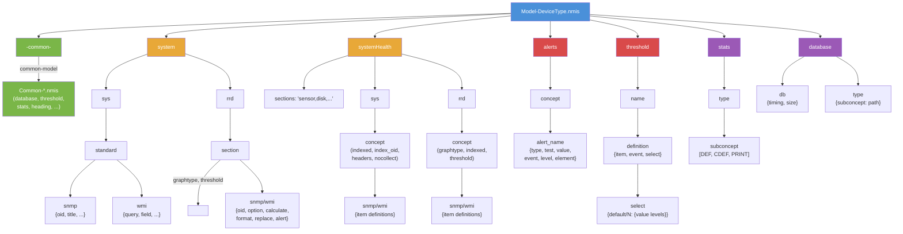
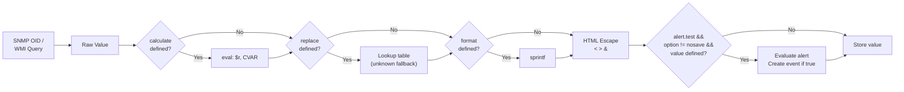
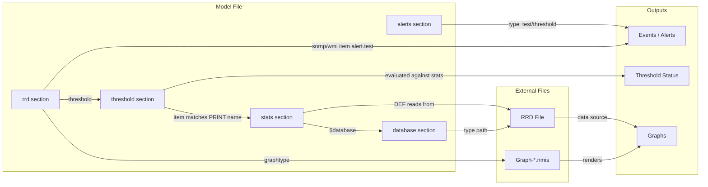
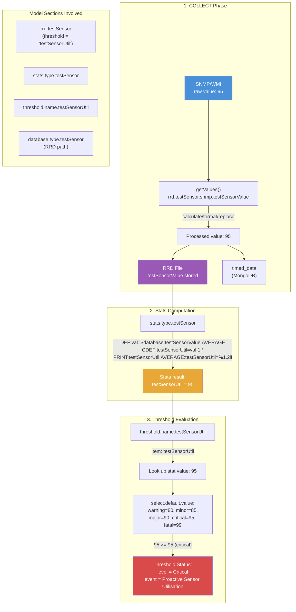

# NMIS9 Model Reference

This document describes every property recognized by NMIS9 device models (`.nmis` files).
Each property listed has been verified against the code that reads it, with source file and line references.

Properties found in existing models that have no code path are flagged as **unused/ignored**.

---

## 1. Model File Basics

- **Format**: Perl data structure (hash), evaluated via `eval`. Extension: `.nmis`
- **Location**: `models-default/` (shipped defaults), `models-custom/` (site-specific overrides)
- **Naming conventions**:
  - `Model-<DeviceType>.nmis` -- per-device-type model
  - `Common-<Name>.nmis` -- shared sections (merged into models via `-common-`)
  - `Graph-<Name>.nmis` -- RRD graph definitions
  - `Override-<Name>.nmis` -- global model overrides (loaded after common files)
- **Model selection**: determined by `sysObjectID` matching during node discovery
- **nodeModel**: set automatically from filename (`Model-TestSnmp.nmis` -> `TestSnmp`), overriding any `nodeModel` in the file itself (`Sys.pm:1681-1683`)

---

## 2. Top-Level Structure

```perl
%hash = (
    '-common-'     => { ... },  # References to Common-*.nmis files
    'system'       => { ... },  # Node-level data (sys + rrd)
    'interface'    => { ... },  # Interface collection (SNMP-only)
    'systemHealth' => { ... },  # Indexed health metrics
    'storage'      => { ... },  # Storage items
    'device'       => { ... },  # Device components
    'alerts'       => { ... },  # Custom alert definitions
    'threshold'    => { ... },  # Threshold policies
    'stats'        => { ... },  # RRD stats calculations (DEF/CDEF/PRINT)
    'heading'      => { ... },  # Graph display metadata
    'database'     => { ... },  # RRD file paths and timing/sizing
    'event'        => { ... },  # Event classification metadata
    'summary'      => { ... },  # Summary statistics
);
```

The top-level keys `system`, `interface`, `systemHealth`, `storage`, and `device` are **collection sections** -- they contain `sys` and/or `rrd` sub-sections with protocol-specific item definitions.

Other top-level keys (`alerts`, `threshold`, `stats`, `heading`, `database`, `event`, `summary`) are **support sections** -- they provide configuration consumed by specific subsystems.

### Model File Structure



---

## 3. The `-common-` Section

Declares which `Common-*.nmis` files to merge into this model.

```perl
'-common-' => {
    'class' => {
        'database'  => { 'common-model' => 'database' },   # loads Common-database.nmis
        'threshold' => { 'common-model' => 'threshold' },   # loads Common-threshold.nmis
        'heading'   => { 'common-model' => 'heading' },
        'stats'     => { 'common-model' => 'stats' },
        'event'     => { 'common-model' => 'event' },
        'summary'   => { 'common-model' => 'summary' },
    }
}
```

### Properties

| Property | Required | Description | Code Reference |
|----------|----------|-------------|----------------|
| `common-model` | Yes | Name suffix for the Common file to load (`'database'` loads `Common-database.nmis`) | `Sys.pm:1688` |

### Loading Behavior

- Common files are loaded in **alphabetical order** by class key name (`Sys.pm:1686`)
- Each is merged via `_mergeHash()` -- keys from common files are added; existing keys in the model take precedence (`Sys.pm:1699`)
- After all common files, **global override files** from config `global_model_overrides` are loaded as `Override-<name>.nmis` (`Sys.pm:1707-1726`)
- The merged model is cached to `<nmis_var>/nmis_system/model_cache/<model>.json` (`Sys.pm:1761-1764`)
- Cache is invalidated when any source file (model, common, config) has a newer mtime (`Sys.pm:1617-1660`)

---

## 4. Collection Sections

Each collection section (e.g., `system`, `systemHealth`) contains two sub-sections:

```perl
'system' => {
    'sys' => {                          # Info data (UPDATE phase)
        'standard' => {
            'snmp' => {
                'sysDescr' => { 'oid' => 'sysDescr', 'title' => 'Description' },
            }
        }
    },
    'rrd' => {                          # Time-series data (COLLECT phase)
        'mib2ip' => {
            'graphtype' => 'ip,fwd',
            'snmp' => {
                'ipInReceives' => { 'oid' => 'ipInReceives', 'option' => 'counter,0:U' },
            }
        }
    }
}
```

### `sys` -- Discovery/Info Data

- Collected during the **UPDATE** phase (`Node.pm: update_node_info`, `collect_systemhealth_info`)
- Data stored in inventory `data` field (MongoDB)
- Used for display, inventory path computation, and index discovery

### `rrd` -- Time-Series Data

- Collected during the **COLLECT** phase (`Node.pm: collect_node_data`, `collect_systemhealth_data`)
- Data stored in RRD files and `timed_data` MongoDB collections
- Used for graphing, threshold evaluation, and alerts

---

## 5. Section-Level Properties

These properties appear at the section level within `sys` or `rrd` blocks.

```perl
'systemHealth' => {
    'sections' => 'testSensor,testCalcOid',          # which sub-sections to collect
    'sys' => {
        'testSensor' => {
            'indexed'   => 'testSensorName',         # field used as index
            'index_oid' => '1.3.6.1.4.1.99999.1.1.1.2',  # OID to walk for discovery
            'headers'   => 'testSensorName,testSensorStatus',
            'snmp' => { ... }
        }
    },
    'rrd' => {
        'testSensor' => {
            'graphtype' => 'testSensor',             # links to Graph-testSensor.nmis
            'indexed'   => 'true',                   # per-index RRD storage
            'threshold' => 'testSensorUtil',         # links to threshold section
            'snmp' => { ... }
        }
    }
}
```

### `indexed`

| | |
|---|---|
| **Type** | string |
| **Required** | Yes for systemHealth sys sections |
| **Valid values** | Field name (e.g., `'testSensorName'`) or `'true'` |
| **Code reference** | `Sys.pm:1211-1222`, `Node.pm:4907`, `Engine/WMI.pm:76,109` |

In `sys` sections: the actual field name used as the index (e.g., `'testSensorName'`).

In `rrd` sections: for SNMP, `'true'` indicates per-index storage. For WMI, **must be the actual field name** (not `'true'`), because it controls whether `gettable` or `get` is used.

`getValues()` uses this to enforce that indexed sections require an `index` parameter and non-indexed sections reject one.

### `index_oid`

| | |
|---|---|
| **Type** | string |
| **Required** | No (defaults to `indexed` value) |
| **Valid values** | Numeric OID string (e.g., `'1.3.6.1.4.1.99999.1.1.1.2'`) |
| **Code reference** | `Node.pm:4909`, `Engine/SNMP.pm:discover_indexes` |

Overrides the `indexed` field name for the SNMP `gettable` call during index discovery. Required when the `indexed` field name is not a valid MIB name that can be resolved to an OID.

### `index_regex`

| | |
|---|---|
| **Type** | string |
| **Required** | No |
| **Valid values** | Regex with one capture group |
| **Default** | `'\.(\d+)$'` |
| **Code reference** | `Node.pm:4905-4910`, `Engine/SNMP.pm:discover_indexes` |

Regex applied to each OID returned by the index table walk. The **first capture group** extracts the index value. Use for multi-part indexes:

```perl
'index_regex' => '\.(\d+\.\d+\.\d+)$'
```

### `index_function`

| | |
|---|---|
| **Type** | string |
| **Required** | No |
| **Valid values** | `'PluginName::function_name'` |
| **Code reference** | `Node.pm:4857-4893` |

Delegates index discovery to a plugin function instead of SNMP/WMI. The function receives named arguments `(node, sys, config, thissection, section, nmisng)` and must return a hash of `{ index => { field => value, ... } }`.

### `index_suffix_oid`

| | |
|---|---|
| **Type** | string |
| **Required** | No |
| **Valid values** | OID string |
| **Code reference** | `Node.pm:5376-5395` |

SNMP-only. During the **collect** phase, this OID is queried with the index appended. The returned value is used as a suffix (`port`) passed to `getData`, affecting the OID suffix computation. Used for complex index schemes where the data OID suffix differs from the discovery index.

### `headers`

| | |
|---|---|
| **Type** | string |
| **Required** | No |
| **Valid values** | Comma-separated field names |
| **Code reference** | `Node.pm:4930/5054`, `Inventory.pm:parse_model_subconcept_headers (256-272)` |

Defines which fields to display as columns in the inventory table. Display titles are pulled from each referenced field's `title` property within the same protocol block.

```perl
'headers' => 'testSensorName,testSensorStatus'
# With:
'snmp' => {
    'testSensorName'   => { 'title' => 'Sensor Name', ... },
    'testSensorStatus' => { 'title' => 'Sensor Status', ... },
}
# Produces: [{ testSensorName => 'Sensor Name' }, { testSensorStatus => 'Sensor Status' }]
```

### `control`

| | |
|---|---|
| **Type** | string |
| **Required** | No |
| **Valid values** | Perl expression returning boolean |
| **Code reference** | `Sys.pm:1226-1244` |

Gate expression evaluated before collecting a section. Has access to catchall variables (`$nodeModel`, `$sysDescr`, `$nodeType`, etc.) via `parseString()`. Section is **skipped entirely** if the expression evaluates to false.

```perl
'control' => '$nodeModel eq "CiscoRouter"'
```

### `skip_collect`

| | |
|---|---|
| **Type** | string |
| **Required** | No |
| **Valid values** | `'true'` or `'false'` |
| **Code reference** | `Sys.pm:1249-1253` |

If `'true'`, the section is skipped during data collection. The section still exists in the model (preserving `graphtype` definitions), but no SNMP/WMI queries are issued. Useful when a plugin provides the data.

### `graphtype`

| | |
|---|---|
| **Type** | string |
| **Required** | Yes (for rrd sections) |
| **Valid values** | Comma-separated graph names |
| **Code reference** | `Sys.pm:1870-1888` |

Maps this section to one or more `Graph-<name>.nmis` graph definitions. During model loading, a `graphtype->subconcept` cache is built so the system knows which inventory concept provides data for each graph.

```perl
'graphtype' => 'ip,fwd,ip-ping'
```

### `threshold`

| | |
|---|---|
| **Type** | string |
| **Required** | No |
| **Valid values** | Threshold definition name from `threshold` top-level section |
| **Code reference** | `Sys.pm:2603+`, threshold evaluation code |

Links this rrd section to a threshold policy. The threshold evaluates stats from the `stats` section for this subconcept.

### `nocollect`

| | |
|---|---|
| **Type** | hash |
| **Required** | No |
| **Valid values** | `{ field_name => regex_or_string }` |
| **Code reference** | `Node.pm:5009-5020` (systemHealth) |

Skip instances whose field value matches the pattern. Supports both compiled regexes (`qr/.../`) and plain strings (auto-compiled).

```perl
'nocollect' => { 'ifDescr' => 'Loopback|Null' }
```

### `placeholder`

| | |
|---|---|
| **Type** | string |
| **Required** | No |
| **Valid values** | Any truthy string (e.g., `'true'`, `'plugin provides data'`) |
| **Code reference** | `Node.pm:4848-4853` |

If set, the section is skipped during collection. Indicates that a plugin or external process provides the data.

### `sections` (systemHealth only)

| | |
|---|---|
| **Type** | string |
| **Required** | No |
| **Valid values** | Comma-separated section names |
| **Code reference** | `Node.pm:4836-4842` |

Lists which sub-sections within `systemHealth` to collect. If not defined, falls back to the `model_health_sections` config value. Can be modified at runtime by Model Policy rules.

### `snmp` / `wmi` / `http_prom` / `http_json`

| | |
|---|---|
| **Type** | hash |
| **Required** | At least one of `snmp`, `wmi`, `http_prom`, `http_json` |
| **Valid values** | Hash of item definitions |
| **Code reference** | `Sys.pm:1256-1261, 1296`; `Engine/HTTP.pm:131` (build_queries); `Engine/HTTP.pm:371` (discover_indexes) |

Protocol-specific item definitions. The engine for a section is selected by which block is present:

- `snmp` -- SNMP OIDs; see [Section 7](#7-snmp-specific-item-properties).
- `wmi` -- WQL queries; see [Section 8](#8-wmi-specific-item-properties).
- `http_prom` -- Prometheus text exposition format scrape; see [Section 9](#9-http-specific-item-properties).
- `http_json` -- JSON API response; see [Section 9](#9-http-specific-item-properties).

In `systemHealth` sections, a section **cannot mix** `snmp` with `wmi` (`Node.pm:4920-4925`). In `system` sections, the SNMP/WMI pair can coexist. HTTP blocks (`http_prom`, `http_json`) are picked up by the HTTP engine independently and may appear alongside or instead of the others.

### `max_rows`

| | |
|---|---|
| **Type** | integer |
| **Required** | No |
| **Valid values** | Positive integer |
| **Code reference** | `Engine/HTTP.pm:447-454` |

Section-level cap on the number of indices `discover_indexes` returns for an HTTP-driven systemHealth section. If the live scrape produces more candidate label tuples than the cap, the engine logs a single warning and truncates rather than spamming per-row errors. Useful as a safety net on metrics with high label cardinality. Today this is honoured only by the HTTP engine.

---

## 6. Common Item Properties

These properties are shared by both SNMP and WMI items. They are processed in `Sys.pm:getValues()` after the raw value is fetched, regardless of protocol.

```perl
# These properties can appear in either snmp or wmi item definitions:
'itemName' => {
    'oid' => '...',              # (SNMP) or 'query'/'field' (WMI)
    'title'     => 'Display Name',
    'option'    => 'gauge,0:U',  # RRD type or 'nosave'
    'calculate' => '$r * 100',   # transform raw value
    'format'    => '%.2f',       # sprintf format
    'replace'   => { '1' => 'Up', '2' => 'Down', 'unknown' => 'Other' },
    'alert'     => { 'test' => '$r > 90', 'event' => 'High Value', 'level' => 'Warning' },
}
```

### `title`

| | |
|---|---|
| **Type** | string |
| **Required** | No |
| **Valid values** | Any string |
| **Code reference** | `Sys.pm:1404` |

Display name used in UI, alerts, and `headers` column titles.

### `option`

| | |
|---|---|
| **Type** | string |
| **Required** | No |
| **Valid values** | `'counter,0:U'`, `'gauge,0:U'`, `'gauge,U:U'`, `'nosave'` |
| **Code reference** | `Sys.pm:1401, 1406-1407` |

RRD data source type specification. Format: `<type>,<min>:<max>`.

- `counter,0:U` -- COUNTER type, min=0, max=unlimited (for monotonically increasing values)
- `gauge,0:U` -- GAUGE type, min=0, max=unlimited
- `gauge,U:U` -- GAUGE, no min/max constraints
- `nosave` -- **Special**: prevents RRD storage AND suppresses inline alert evaluation for this item

### `calculate`

| | |
|---|---|
| **Type** | string |
| **Required** | No |
| **Valid values** | Perl expression |
| **Code reference** | `Sys.pm:1346-1367` |

Transform the raw value after fetch. Applied via `eval_string()`.

**Variables available**:
- `$r` -- the raw value from SNMP/WMI
- `CVAR1=fieldname;expression` -- reference another item's raw value

**Return behavior**:
- Returns the computed value
- If returns `undef`, the value is treated as invalid: alerts are suppressed, but the undef is still stored

```perl
'calculate' => 'CVAR1=rawCounter;return int($r / 10) + $CVAR1;'
```

### `format`

| | |
|---|---|
| **Type** | string |
| **Required** | No |
| **Valid values** | sprintf format string |
| **Code reference** | `Sys.pm:1382-1385` |

Applied **after** `calculate`. Formats the value using Perl's `sprintf`.

```perl
'format' => '%.2f'   # 3.14159 becomes "3.14"
```

### `replace`

| | |
|---|---|
| **Type** | hash |
| **Required** | No |
| **Valid values** | `{ value => label, 'unknown' => fallback }` |
| **Code reference** | `Sys.pm:1370-1379` |

Lookup table for value substitution. Applied **after** `calculate`.

- If the value matches a key, the corresponding label is returned
- If no match and an `'unknown'` key exists, the fallback is returned
- If no match and no `'unknown'` key, the original value is kept unchanged

```perl
'replace' => {
    '1' => 'Up',
    '2' => 'Down',
    'unknown' => 'Other'
}
```

### `alert`

| | |
|---|---|
| **Type** | hash |
| **Required** | No |
| **Valid values** | Hash with `test`, `event`, `level`, optionally `calculate_details` |
| **Code reference** | `Sys.pm:1408-1450` |

Inline alert definition, evaluated during data collection.

| Sub-property | Required | Description |
|-------------|----------|-------------|
| `test` | Yes | Perl expression. `$r` = current value. Supports CVAR. Alert fires if truthy. |
| `event` | Yes | Event name string (e.g., `'High Sensor Value'`) |
| `level` | Yes | Severity: `'Warning'`, `'Minor'`, `'Major'`, `'Critical'`, `'Fatal'` |
| `calculate_details` | No | Perl expression for custom alert detail text |

**Suppression rules**:
- Suppressed if `option` = `'nosave'`
- Suppressed if value is `undef` (e.g., from `calculate` returning undef)

```perl
'alert' => {
    'test'  => '$r > 90',
    'event' => 'High Sensor Value',
    'level' => 'Warning'
}
```

### `sysObjectName`

| | |
|---|---|
| **Type** | string |
| **Required** | No |
| **Valid values** | Field name |
| **Code reference** | `Inventory.pm:parse_model_for_tags` |

Logical name mapping for this item. Used in inventory tagging and headers display.

---

## 7. SNMP-Specific Item Properties

Properties unique to items within an `snmp` block. All [common item properties](#6-common-item-properties) also apply.

```perl
'snmp' => {
    'sysDescr' => {
        'oid'   => 'sysDescr',          # OID name (resolved via MIB)
        'title' => 'Description',
    },
    'calcOidValue' => {
        'oid'             => '1.3.6.1.4.1.99999.3.1',
        'option'          => 'gauge,0:U',
        'calculate_index' => 'CVAR1=index;return "$CVAR1.0";',  # dynamic suffix
    }
}
```

### `oid`

| | |
|---|---|
| **Type** | string |
| **Required** | Yes |
| **Valid values** | OID name (e.g., `'sysDescr'`) or numeric OID (e.g., `'1.3.6.1.2.1.1.1.0'`) |
| **Code reference** | `Engine/SNMP.pm:95-116` |

The SNMP OID to query. Leading dots are **silently stripped** during model loading (`Sys.pm:1749-1752`).

**Named OIDs** (e.g., `'sysDescr'`): Resolved via MIB files. `.0` is automatically appended by `getarray()` via `name_to_oid()` when the name has no numeric tail (`Snmp.pm:151`). No need to include `.0` in the model.

**Numeric OIDs** (e.g., `'1.3.6.1.4.1.99999.2.1.0'`): Used as-is. For non-indexed sections querying scalar values, `.0` **must** be included explicitly in the model.

For indexed sections, the index value (or computed suffix) is automatically appended as `.<index>` regardless of OID type.

### `calculate_index`

| | |
|---|---|
| **Type** | string |
| **Required** | No |
| **Valid values** | Perl expression |
| **Code reference** | `Engine/SNMP.pm:42-67` |

Compute a dynamic OID suffix instead of using the default `.<index>`. Supports CVAR referencing inventory data fields. The return value becomes the suffix (with `.` prepended).

```perl
'calculate_index' => 'CVAR1=index;return "$CVAR1.0";'
# If index=1, the suffix becomes .1.0 instead of .1
```

### `calculate_oid`

| | |
|---|---|
| **Type** | string |
| **Required** | No |
| **Valid values** | Perl expression |
| **Code reference** | `Engine/SNMP.pm:70-93` |

Compute the **entire OID** dynamically. The return value replaces the `oid` property entirely. Supports CVAR for inventory data.

---

## 8. WMI-Specific Item Properties

Properties unique to items within a `wmi` block. All [common item properties](#6-common-item-properties) also apply.

```perl
'wmi' => {
    '-common-' => { 'query' => 'SELECT Name,Size,FreeSpace FROM Win32_LogicalDisk WHERE DriveType=3' },
    'Name'             => { 'field' => 'Name', 'title' => 'Disk Name' },
    'wmiDiskSize'      => { 'field' => 'Size', 'title' => 'Disk Size' },
    'wmiDiskFreeSpace' => { 'field' => 'FreeSpace', 'option' => 'gauge,0:U',
                            'alert' => { 'test' => '$r < 1073741824', 'event' => 'Low Disk Space', 'level' => 'Warning' } },
}
```

### `query`

| | |
|---|---|
| **Type** | string |
| **Required** | Yes (or inherited from `-common-`) |
| **Valid values** | WQL query string |
| **Code reference** | `Engine/WMI.pm:42-50` |

The WQL query to execute. If not present on the item, inherited from the `-common-` sub-section within the same `wmi` block.

```perl
'query' => 'SELECT Caption,Version FROM Win32_OperatingSystem'
```

### `field`

| | |
|---|---|
| **Type** | string |
| **Required** | Yes |
| **Valid values** | WMI result field name |
| **Code reference** | `Engine/WMI.pm:50, 141-145` |

The field name to extract from the WQL result set.

### WMI `-common-` Sub-Section

Items without their own `query` property inherit from a `-common-` entry in the same `wmi` block. This avoids repeating the same WQL query for every field. The `-common-` key itself is skipped during query building (`Engine/WMI.pm:35`).

### WMI `indexed` Caveat

In WMI `rrd` sections, the `indexed` property **must be the actual WMI field name** used for indexing, not just `'true'`. This field name is passed to `gettable()` as the index parameter (`Engine/WMI.pm:109-114`). Using `'true'` will cause `gettable` to try indexing by a field literally named `"true"`.

---

## 9. HTTP-Specific Item Properties

Properties unique to items within an `http_prom` or `http_json` block. All [common item properties](#6-common-item-properties) (`title`, `option`, `calculate`, `format`, `replace`, `alert`) also apply.

The HTTP engine reads metrics from HTTP endpoints, picking up two scrape formats independently:

- **`http_prom`** -- the endpoint serves Prometheus text exposition format (`# TYPE`, `# HELP`, `metric{labels} value` lines). Items declare a Prometheus metric name; the engine parses the response and matches by name (and optionally by label).
- **`http_json`** -- the endpoint serves JSON. Items declare a JSONPath expression; the engine fetches and decodes once, then extracts each item's value via `lib/NMISNG/JSONPath.pm`.

Connection details (host, port, scheme, auth) live on the node config under `http_endpoints` -- see [HTTP Endpoint Configuration](#http-endpoint-configuration-node-level) below.

```perl
'http_prom' => {
    '-common-' => { 'endpoint' => 'node_exporter' },
    'load1'    => { 'metric' => 'node_load1' },
    'cpu_user' => { 'metric'       => 'node_cpu_seconds_total',
                    'match_labels' => { 'mode' => 'user' },
                    'option'       => 'counter,0:U' },
},
'http_json' => {
    '-common-' => { 'endpoint' => 'app_status', 'path' => '/api/health' },
    'state'    => { 'jsonpath' => '$.app.state' },
    'uptime'   => { 'jsonpath' => '$.app.uptime_seconds' },
}
```

### `metric`

| | |
|---|---|
| **Type** | string |
| **Required** | Yes (for `http_prom` items, unless using the [index-self pattern](#index-self-pattern) or `calculate_url`) |
| **Valid values** | Prometheus metric name (e.g., `'node_load1'`, `'node_filesystem_size_bytes'`) |
| **Code reference** | `Engine/HTTP.pm:234`, sample matching at `Engine/HTTP.pm:430-436` |

The Prometheus metric name to extract. The engine scrapes the endpoint once per URL (response cached across all items pointing at the same endpoint+path), parses the text into samples via `lib/NMISNG/PromText.pm`, and selects samples whose name matches `metric`. For non-indexed sections, the first matching sample wins. For indexed sections, the sample whose `indexed` label equals the row's index value is used.

### `match_labels`

| | |
|---|---|
| **Type** | hash |
| **Required** | No |
| **Valid values** | `{ label_name => label_value }` pairs |
| **Code reference** | `Engine/HTTP.pm:249-252`, value extraction at `Engine/HTTP.pm:531-553` |

Narrows sample selection by requiring exact label matches in addition to `metric`. Necessary when the same metric is exposed with multiple label combinations -- a fundamental Prometheus pattern that has no SNMP/WMI equivalent.

#### Why it's needed

A Prometheus metric name is not unique on the wire; the same name can produce many simultaneous samples distinguished only by their labels. A canonical example is `node_cpu_seconds_total` from node_exporter:

```text
node_cpu_seconds_total{cpu="0",mode="user"}      12345.6
node_cpu_seconds_total{cpu="0",mode="system"}      678.9
node_cpu_seconds_total{cpu="0",mode="iowait"}       42.0
node_cpu_seconds_total{cpu="0",mode="idle"}      98765.4
node_cpu_seconds_total{cpu="0",mode="irq"}           0.7
node_cpu_seconds_total{cpu="0",mode="softirq"}       3.2
node_cpu_seconds_total{cpu="0",mode="steal"}         0.0
node_cpu_seconds_total{cpu="0",mode="nice"}          1.1
node_cpu_seconds_total{cpu="1",mode="user"}      11122.3
... eight `mode` samples per `cpu` value
```

A section indexed by `cpu` produces one row per core; each row's collection sees all eight mode samples (all valid, all with the matching `cpu` label). To split them into separate ds entries (`mode_user`, `mode_system`, `mode_iowait`, ...) so each gets its own RRD column and graph DEF, every item declares `match_labels` to pin the second dimension:

```perl
'mode_user'   => { 'metric' => 'node_cpu_seconds_total',
                   'match_labels' => { 'mode' => 'user' } },
'mode_system' => { 'metric' => 'node_cpu_seconds_total',
                   'match_labels' => { 'mode' => 'system' } },
'mode_iowait' => { 'metric' => 'node_cpu_seconds_total',
                   'match_labels' => { 'mode' => 'iowait' } },
```

Without `match_labels` the engine would just take the first sample whose `cpu` matches and every mode_* ds would get the same value. The same pattern applies to `node_systemd_unit_state{name="...", state="active|failed|inactive|..."}` (`match_labels => { state => 'active' }`) and any other metric that uses a label as a "second axis" beyond the section index.

#### Not the same as `control` -- and not a return of `label_filter`

`match_labels` looks superficially similar to two other label-related mechanisms but operates on a different axis from both. Quick reference so the three don't get conflated:

| Mechanism | What it gates | When it runs |
|---|---|---|
| `control` ([Section 5](#5-section-level-properties)) | Whether the row is actively collected | Per-row, in `Sys::getValues` |
| `match_labels` (this property) | Which of a metric's label-distinguished samples maps to this ds | Per-ds, in `Engine::HTTP::_extract_value` |
| `label_filter` (removed) | Was a per-row regex shortcut on the index label; fully replaced by `control`, which preserves inventory for filtered rows. Not coming back. | -- |

`control` and `match_labels` compose -- a model uses `control` on the rrd block to decide which CPU cores are actively collected, and `match_labels` on each item to map the right sample to each mode_* ds.

### `jsonpath`

| | |
|---|---|
| **Type** | string |
| **Required** | Yes (for `http_json` items, unless using the [index-self pattern](#index-self-pattern) or `calculate_url`) |
| **Valid values** | JSONPath expression |
| **Code reference** | `Engine/HTTP.pm:257-263`; parser in `lib/NMISNG/JSONPath.pm` |

JSONPath expression that selects a value from the decoded JSON response. Supported subset: root (`$`), dotted keys (`$.key.subkey`), bracketed dotted keys (`$["dotted.name"]`), array indexing (`[0]`, `[N]`), array splat (`[*]`), and object splat (`.*`). Slices, filters, and negative indexes are rejected with a clear error -- if you need them, do the work in a `calculate` expression after extraction.

```perl
'state'  => { 'jsonpath' => '$.app.state' },
'first'  => { 'jsonpath' => '$.members[0].value' },
'all'    => { 'jsonpath' => '$.devices[*].temp' },
```

### `calculate_url`

| | |
|---|---|
| **Type** | string |
| **Required** | No |
| **Valid values** | Perl expression that returns a URL or path string |
| **Code reference** | `Engine/HTTP.pm:198-213` |

Compute the per-item URL dynamically. Evaluated as a Perl expression with `parseString` (so `CVAR=fieldname;...` works against the row's inventory data). The return value can be either an absolute URL (`https://host:port/path`) or a path that gets joined to the endpoint's base URL.

Use case: per-row JSON endpoints where the path includes the row's identifier. The F5 BigIP API pattern is the canonical example -- a pool's stats live at `/mgmt/tm/ltm/pool/<name>/stats`, so the model declares:

```perl
'pool_stats' => {
    'calculate_url' => 'CVAR1=poolPath; return $CVAR1;',
    'jsonpath'      => '$.entries[*].nestedStats.entries.activeMemberCnt.value',
},
```

`calculate_url` may also live in `-common-` to share a templated path across every item in the block.

### `endpoint`

| | |
|---|---|
| **Type** | string |
| **Required** | Yes (in `-common-` or per-item) |
| **Valid values** | Name from the node's `http_endpoints` array |
| **Code reference** | `Engine/HTTP.pm:_resolve_url` (line 118), endpoint registry in `Engine/HTTP.pm:set_endpoints` |

Names which entry in the node's `http_endpoints` config supplies the host, port, scheme, and auth. Almost always declared once in `-common-` and inherited by every item:

```perl
'http_prom' => {
    '-common-' => { 'endpoint' => 'node_exporter' },
    'load1'    => { 'metric' => 'node_load1' },     # uses node_exporter
}
```

Per-item overrides are allowed if a single section needs to read from multiple endpoints.

### `path`

| | |
|---|---|
| **Type** | string |
| **Required** | No (default `/metrics` for `http_prom`; required for `http_json`) |
| **Valid values** | URL path (e.g., `'/metrics'`, `'/api/v1/health'`) or absolute URL |
| **Code reference** | `Engine/HTTP.pm:217`, default for prom at `Engine/HTTP.pm:412` |

URL path appended to the endpoint's base URL. Most commonly placed in `-common-`. If the value begins with `http://` or `https://`, it's used verbatim and bypasses the endpoint's host/port/scheme.

### Index-Self Pattern

In an indexed section, an item with no `metric`, `jsonpath`, or `calculate_url` is treated specially: the engine fills its `rawvalue` with the row's index value. This lets a model store the index as a first-class inventory field without spending an extra metric extraction on it.

```perl
'http_prom' => {
    '-common-' => { 'endpoint' => 'node_exporter' },
    'device'   => { 'title' => 'Interface name' },           # index-self
    'rx_bytes' => { 'metric' => 'node_network_receive_bytes_total' },
}
```

For the row indexed by `device='eth0'`, the inventory ends up with both `device='eth0'` (from index-self) and `rx_bytes=<the counter value>` (from the metric). The pattern is detected at `Engine/HTTP.pm:160-172`.

Outside an indexed section, a metric-less item is still an error -- there's no fallback semantics that make sense without a row identifier.

### `-common-` Sub-Section

Items without their own `endpoint`, `path`, or `calculate_url` inherit from a `-common-` entry in the same `http_prom` or `http_json` block. The `-common-` key itself is skipped during query building (`Engine/HTTP.pm:148`). Mirrors the WMI convention.

### HTTP Endpoint Configuration (node-level)

The HTTP engine does not take connection details from the model -- those live on the node, in the `http_endpoints` field of `conf-default/Table-Nodes.nmis`:

```perl
{ http_endpoints => { header => 'HTTP Endpoints (JSON)', display => 'textbox', value => [''] } },
{ api_user       => { header => 'API Username', display => 'text', value => [''] } },
{ api_pass       => { header => 'API Password', display => 'password', value => [''] } },
```

`http_endpoints` is stored as a JSON array of endpoint records; the GUI exposes it as a textbox. Each record:

```json
{ "name": "node_exporter",
  "scheme": "http",
  "host": "192.168.1.10",
  "port": 9100,
  "auth": { "type": "none" } }
```

#### Endpoint record fields

| Field | Required | Description |
|---|---|---|
| `name` | Yes | Identifier referenced by the model's `endpoint` property. |
| `scheme` | No (default `http`) | `http` or `https`. (`Engine/HTTP.pm:109`) |
| `host` | No (default: node's `host`) | Hostname or IP. (`Engine/HTTP.pm:111`) |
| `port` | No (default: 80/443 by scheme) | TCP port. (`Engine/HTTP.pm:112`) |
| `auth` | No (default `{ type => 'none' }`) | Authentication sub-record; see below. |

#### `auth.type`

Five auth mechanisms are supported. All live in `lib/NMISNG/Sys/Engine/HTTP/Auth.pm`; see line numbers in each row.

| `type` | Behaviour | Required keys (besides `type`) | Code |
|---|---|---|---|
| `none` | No auth header. | -- | `Auth.pm:41` |
| `header` | Inject arbitrary static headers. | `headers` (hash of `name => value`) | `Auth.pm:48` |
| `bearer` | `Authorization: Bearer <token>`. | `token` | `Auth.pm:57` |
| `basic` | HTTP Basic. Falls back to node's `api_user` / `api_pass` if `user` / `pass` not on the endpoint. | `user`, `pass` (or node-level `api_user`, `api_pass`) | `Auth.pm:66-67` |
| `token_fetch` | POST credentials to a login URL, extract a session token via JSONPath, inject it on subsequent calls; cache to disk for `ttl_seconds`; refresh on 401. | `login_url`, `token_jsonpath`, `inject_header`, plus body construction (`body` or `calculate_body`); see below | `Auth.pm:153-244` |

#### `token_fetch` options

| Field | Required | Default | Description | Code |
|---|---|---|---|---|
| `login_url` | Yes | -- | Endpoint-relative or absolute URL for the login POST. | `Auth.pm:192` |
| `method` | No | `POST` | HTTP method for the login request. | `Auth.pm:196` |
| `content_type` | No | -- | `Content-Type` header for the login request. | `Auth.pm:217` |
| `body` | No (one of `body` / `calculate_body` required) | -- | Static request body. | `Auth.pm:211` |
| `calculate_body` | No (one of `body` / `calculate_body` required) | -- | Perl expression to build the body dynamically; CVARs read from node config (so `CVAR1=api_user; CVAR2=api_pass; ...` works). | `Auth.pm:200-208` |
| `token_jsonpath` | Yes | -- | JSONPath into the login response that yields the token string. | `Auth.pm:238` |
| `inject_header` | Yes | -- | Header name on every authenticated request (e.g. `X-F5-Auth-Token`). | `Auth.pm:157` |
| `ttl_seconds` | No | `300` | Cache lifetime for the fetched token. | `Auth.pm:174` |
| `retry_on_401` | No | `1` (true) | If the authenticated request returns 401, invalidate the token, refetch, and retry once. | `Engine/HTTP.pm:486` |

The fetched token is written to a per-node, mode-`0600` cache file under `var/nmis_system/http_token_cache/`. It's read back on subsequent runs to avoid logging in every poll cycle.

### Row filtering: use `control`, not a separate property

For HTTP-driven indexed sections (filesystems, interfaces, disks, systemd units), filtering noisy rows uses the standard NMIS `control` property on the rrd block (documented in [Section 5](#5-section-level-properties)) -- not an HTTP-specific filter. Discovery returns every label tuple the metric exposes; `control` decides which rows write fresh RRD data each poll. Inventory is preserved for every discovered row, matching the SNMP/WMI behaviour, so an operator can relax the `control` regex without losing history.

```perl
'rrd' => {
    'LinuxDiskIO' => {
        'graphtype' => 'Linux-DiskIO',
        'indexed'   => 'device',
        'control'   => 'CVAR=device;$CVAR =~ /^(sd[a-z]+|nvme\d+n\d+|vd[a-z]+|dm-\d+)$/',
        'http_prom' => { ... },
    },
}
```

### Soft skip: missing endpoint

If a model section declares an `endpoint` that the node doesn't have configured, the engine logs and returns no data without poisoning the polling cycle (`Engine/HTTP.pm:classify_error` reports `not_present`, treated as non-fatal by `Node::collect_systemhealth_info`). This makes it safe to keep optional HTTP sections in shared models -- nodes without that endpoint silently skip the section.

---

## 10. Value Processing Order

The exact order values are processed in `getValues()` (`Sys.pm:1328-1452`):

1. **Raw fetch**: SNMP OID query or WMI field extraction
2. **`calculate`**: Perl expression applied (`$r` = raw value, CVAR for cross-references)
3. **`replace`**: Lookup table substitution (with `unknown` fallback)
4. **`format`**: sprintf formatting
5. **HTML escaping**: `<`, `>`, `&` are entity-encoded (`&lt;`, `&gt;`, `&amp;`)
6. **Alert evaluation**: If `alert.test` is defined AND `option` != `'nosave'` AND value is defined

**Note**: `calculate` and `replace` should generally not be combined in the same item, but if they are, `calculate` runs first.

### Value Processing Pipeline



---

## 11. The `alerts` Section

Defines custom alerts evaluated per inventory item during `handle_custom_alerts()` (`Node.pm:6188+`).

```perl
'alerts' => {
    'concept_name' => {
        'alert_name' => {
            'type'      => 'test',
            'test'      => 'CVAR1=testSensorValue;$CVAR1 > 80',
            'value'     => 'CVAR1=testSensorValue;$CVAR1',
            'event'     => 'Custom Sensor Alert',
            'level'     => 'Minor',
            'element'   => 'testSensorName',
            'unit'      => '',
            'control'   => '$nodeType eq "server"',
        }
    }
}
```

### Alert Properties

| Property | Required | Valid Values | Code Reference | Description |
|----------|----------|--------------|----------------|-------------|
| `type` | Yes | `'test'`, `'threshold-rising'`, `'threshold-falling'` | `Node.pm:6049` | Alert evaluation strategy |
| `test` | Yes (type=test) | Perl expression with CVAR | `Node.pm:6054-6098` | Condition expression. Alert fires if truthy. |
| `value` | Yes | Perl expression with CVAR | `Node.pm:6054-6098` | Value to display and/or compare against thresholds |
| `threshold` | Yes (threshold types) | `{ Warning=>N, Minor=>N, Major=>N, Critical=>N, Fatal=>N }` | `Node.pm:6111-6150` | Level thresholds for threshold-type alerts |
| `event` | Yes | String | `Node.pm:6157` | Event name to create |
| `level` | Yes (type=test) | `'Warning'`, `'Minor'`, `'Major'`, `'Critical'`, `'Fatal'` | `Node.pm:6158` | Severity for test-type alerts |
| `element` | Yes | Field name from inventory data | `Node.pm:6159` | Inventory data field whose value identifies the alerting instance (see example below) |
| `unit` | No | String | `Node.pm:6156` | Unit of measurement for display |
| `control` | No | Perl expression | `Node.pm:6032-6045` | Gate expression; alert skipped if false |
| `calculate_details` | No | Perl expression | `Node.pm:6169, 6220` | Custom detail text calculation |

### Alert Types

- **`test`**: Evaluates `test` expression. If truthy, creates alert at specified `level`.
- **`threshold-rising`**: Compares `value` against `threshold` levels. Alert fires at the **highest** matching level (values increasing = worse).
- **`threshold-falling`**: Same but inverted -- lower values are worse.

### CVAR Syntax in Alerts

CVAR expressions reference inventory `data` fields:

```perl
'value' => 'CVAR1=testSensorValue;$CVAR1'
# Reads $inventory->data->{testSensorValue} into $CVAR1
```

### How `element` Works

The `element` property names an inventory `data` field whose **value** becomes the human-readable identifier in the alert. It tells the alert system *which instance* triggered the alert.

```perl
# During UPDATE, collect_systemhealth_info discovers indexes and stores:
#   inventory->data = { testSensorName => "TempSensor1", testSensorValue => 95, index => 1 }
#   inventory->data = { testSensorName => "TempSensor2", testSensorValue => 42, index => 2 }

# The alert definition references the NAME field, not the index:
'alerts' => {
    'testSensor' => {
        'highTemp' => {
            'type'    => 'test',
            'test'    => 'CVAR1=testSensorValue;$CVAR1 > 80',
            'value'   => 'CVAR1=testSensorValue;$CVAR1',
            'event'   => 'High Temperature',
            'level'   => 'Warning',
            'element' => 'testSensorName',    # <-- reads inventory->data->{testSensorName}
            #                                       alert says "TempSensor1" not "1"
        }
    }
}
# When index 1 fires: element = "TempSensor1", value = 95
# When index 2 does not fire: testSensorValue 42 <= 80
```

The `element` field name typically comes from the `sys` section of the same concept, where it was populated during index discovery via `loadInfo`.

---

## 12. The `threshold` Section

Defines threshold policies evaluated during `compute_thresholds` (`Sys.pm:2603+`).

```perl
'threshold' => {
    'name' => {
        'testSensorUtil' => {
            'item'    => 'testSensorUtil',
            'event'   => 'Proactive Sensor Utilisation',
            'title'   => 'Sensor Utilisation',
            'unit'    => '%',
            'select'  => {
                'default' => {
                    'value' => {
                        'warning'  => '80',
                        'minor'    => '85',
                        'major'    => '90',
                        'critical' => '95',
                        'fatal'    => '99'
                    }
                },
                '10' => {
                    'control' => '$nodeType eq "server"',
                    'value'   => { 'warning' => '70', ... }
                }
            }
        }
    }
}
```

### Threshold Properties

| Property | Required | Valid Values | Code Reference | Description |
|----------|----------|--------------|----------------|-------------|
| `item` | Yes | Stat name | `Sys.pm:2671-2674` | Key in the stats output hash to evaluate |
| `event` | Yes | String | threshold evaluation | Event name to create |
| `title` | No | String | display | Display title |
| `unit` | No | String | display | Unit of measurement |
| `select` | Yes | Hash of selection sets | `Sys.pm:2634-2660` | Threshold level sets (evaluated in sort order) |

### Select Sets

Select entries are evaluated in **numeric sort order**. The first entry whose `control` expression passes is used. The key `'default'` always matches (used as fallback).

| Select Sub-property | Required | Description |
|--------------------|----------|-------------|
| `control` | No (required for non-default) | Perl expression; set is used if truthy |
| `value` | Yes | Hash of `{ warning, minor, major, critical, fatal }` threshold values |

### Direction Auto-Detection

- If `warning < fatal` (ascending): **higher values are worse** (e.g., CPU utilization)
- If `warning > fatal` (descending): **lower values are worse** (e.g., free disk space)

Direction is determined by comparing the warning and fatal values (`Sys.pm:2703-2740`).

### Connection to Stats

The `item` value must match a stat name produced by a `PRINT` line in the `stats` section. The `threshold` property on an `rrd` section links the two:

```
rrd section (threshold => 'testSensorUtil')
  --> threshold definition (item => 'testSensorUtil')
  --> stats PRINT line (PRINT:testSensorUtil:AVERAGE:testSensorUtil=%1.2lf)
```

---

## 13. The `stats` Section

Defines RRDtool graph commands for computing derived statistics.

```perl
'stats' => {
    'type' => {
        'testSensor' => [
            'DEF:val=$database:testSensorValue:AVERAGE',
            'CDEF:testSensorUtil=val,1,*',
            'PRINT:testSensorUtil:AVERAGE:testSensorUtil=%1.2lf'
        ],
        'health' => [
            'DEF:reachability=$database:reachability:AVERAGE',
            'PRINT:reachability:AVERAGE:reachability=%1.2lf'
        ]
    }
}
```

### How It Works

Consumed by `Compat::NMIS::getSubconceptStats()` (`Compat/NMIS.pm`):

1. Finds the RRD storage path from inventory
2. Looks up stats definition: `$model->{stats}{type}{$subconcept}`
3. Performs variable substitution in each line:
   - `$database` -> RRD file path
   - `$speed`, `$inSpeed`, `$outSpeed` -> interface speeds
   - Other `$variable` references from inventory data
4. Executes via `RRDs::graphv()` to compute values
5. Returns hash: `{ stat_name => numeric_value, ... }`

### RRD Command Types

| Command | Format | Description |
|---------|--------|-------------|
| `DEF` | `DEF:varname=$database:ds_name:CF` | Define a data source from RRD. CF = AVERAGE, MAX, MIN, LAST |
| `CDEF` | `CDEF:varname=rpn_expression` | Calculate a new variable using RPN (Reverse Polish Notation) |
| `PRINT` | `PRINT:varname:CF:name=%format` | Extract a named value. The `name=` part becomes the key in the returned hash |

The `name` in `PRINT` lines **must match** the `item` field in threshold definitions for thresholds to work.

---

## 14. The `database` Section

Defines RRD file paths and retention policies. Usually provided via `Common-database.nmis`.

```perl
'database' => {
    'db' => {
        'timing' => {
            'default' => { 'poll' => 300, 'heartbeat' => 900 }
        },
        'size' => {
            'default' => {
                'step_day'   => '1',   'rows_day'   => '2304',
                'step_week'  => '6',   'rows_week'  => '1536',
                'step_month' => '24',  'rows_month' => '2268',
                'step_year'  => '288', 'rows_year'  => '1890'
            }
        }
    },
    'type' => {
        'health'       => '/nodes/$node/health/reach.rrd',
        'mib2ip'       => '/nodes/$node/health/mib2ip.rrd',
        'testSensor'   => '/nodes/$node/health/testSensor-$index.rrd',
    }
}
```

### `db` Sub-section

| Property | Description |
|----------|-------------|
| `timing.default.poll` | Poll interval in seconds (default: 300) |
| `timing.default.heartbeat` | Maximum seconds before a value is considered unknown (default: 900) |
| `size.default.step_*` | Consolidation step for each archive (day/week/month/year) |
| `size.default.rows_*` | Number of data points stored for each archive |

### `type` Sub-section

Maps subconcept names to RRD file path templates. Path variables:

| Variable | Description |
|----------|-------------|
| `$node` | Node name |
| `$index` | Instance index (for indexed sections) |
| `$item` | Item identifier |
| `$ifDescr` | Interface description |
| `$group` | Node group |

---

## 15. System Section Special Properties

The `system` section has properties that set node-level metadata:

```perl
'system' => {
    'nodeModel' => 'TestSnmp',          # Set automatically from filename
    'nodeType'  => 'generic',           # Device type classification
    'nodegraph' => 'health,response',   # Default graph types for the node
    'sys' => { ... },
    'rrd' => { ... }
}
```

| Property | Code Reference | Description |
|----------|----------------|-------------|
| `nodeModel` | `Sys.pm:1681-1683` | Overridden by filename. Included in model for reference only. |
| `nodeType` | `Node.pm` various | Device type: `'generic'`, `'switch'`, `'router'`, `'server'`, `'firewall'` |
| `nodegraph` | Graph system | Comma-separated default graph types shown for this node |

---

## 16. Model Policy

Not part of model files, but affects model loading. Stored in `conf/Model-Policy.nmis`.

```perl
%hash = (
    '10' => {
        'IF' => {
            'node.nodeModel' => '/Cisco/',          # regex match
            'node.nodeVendor' => 'Cisco Systems',   # exact match
            'config.some_flag' => 'true',            # config check
        },
        'systemHealth' => {
            'ciscoMemory' => 'true',       # add this section
            'unusedSection' => 'false',    # remove this section
        }
    }
);
```

### Policy Behavior (`Sys.pm:1772-1868`)

- Rules evaluated in **numeric sort order** by key
- **First matching rule wins** (subsequent rules are not evaluated)
- All `IF` conditions must match (AND logic)
- `IF` values can be: exact string, regex (`/pattern/` or `/pattern/i`), or array of exact strings
- Currently only `systemHealth` sections can be added/removed
- Applied **after** cache load, so policy changes take effect without cache invalidation

---

## 17. Properties Ignored by Code

These properties appear in existing models but have no active code path:

| Property | Notes |
|----------|-------|
| `no_graphs` | Referenced in commented-out code at `Sys.pm:1281`. Never evaluated. |
| Leading dots on OIDs | Silently stripped during model loading (`Sys.pm:1749-1752`). Not an error but indicates model imprecision. |

---

## 18. Complete Example: SNMP systemHealth Section

```perl
'systemHealth' => {
    'sections' => 'testSensor',
    'sys' => {
        'testSensor' => {
            'indexed'   => 'testSensorName',
            'index_oid' => '1.3.6.1.4.1.99999.1.1.1.2',
            'headers'   => 'testSensorName,testSensorStatus',
            'snmp' => {
                'testSensorName' => {
                    'oid'           => '1.3.6.1.4.1.99999.1.1.1.2',
                    'title'         => 'Sensor Name',
                    'sysObjectName' => 'testSensorName',
                },
                'testSensorStatus' => {
                    'oid'           => '1.3.6.1.4.1.99999.1.1.1.4',
                    'title'         => 'Sensor Status',
                    'sysObjectName' => 'testSensorStatus',
                },
            }
        }
    },
    'rrd' => {
        'testSensor' => {
            'graphtype' => 'testSensor',
            'indexed'   => 'true',
            'threshold' => 'testSensorUtil',
            'snmp' => {
                'testSensorValue' => {
                    'oid'    => '1.3.6.1.4.1.99999.1.1.1.3',
                    'option' => 'gauge,0:U',
                    'title'  => 'Sensor Value',
                    'alert'  => {
                        'test'  => '$r > 90',
                        'event' => 'High Sensor Value',
                        'level' => 'Warning',
                    },
                },
            }
        }
    }
},
'alerts' => {
    'testSensor' => {
        'testSensorTestAlert' => {
            'type'    => 'test',
            'test'    => 'CVAR1=testSensorValue;$CVAR1 > 80',
            'value'   => 'CVAR1=testSensorValue;$CVAR1',
            'event'   => 'Custom Sensor Alert',
            'level'   => 'Minor',
            'element' => 'testSensorName',
            'unit'    => '',
        },
    }
},
'threshold' => {
    'name' => {
        'testSensorUtil' => {
            'item'  => 'testSensorUtil',
            'event' => 'Proactive Sensor Utilisation',
            'title' => 'Sensor Utilisation',
            'unit'  => '%',
            'select' => {
                'default' => {
                    'value' => {
                        'warning'  => '80',
                        'minor'    => '85',
                        'major'    => '90',
                        'critical' => '95',
                        'fatal'    => '99',
                    }
                }
            }
        }
    }
},
'stats' => {
    'type' => {
        'testSensor' => [
            'DEF:val=$database:testSensorValue:AVERAGE',
            'CDEF:testSensorUtil=val,1,*',
            'PRINT:testSensorUtil:AVERAGE:testSensorUtil=%1.2lf',
        ]
    }
}
```

### How the Pieces Connect

1. **Update phase**: `collect_systemhealth_info` walks `index_oid`, discovers indexes (e.g., 1, 2), creates inventory per index
2. **Collect phase**: `collect_systemhealth_data` calls `getData` for each non-historic index, which calls `getValues` on the `rrd` section
3. `getValues` builds SNMP queries from `oid` + index suffix, fetches, processes (calculate/replace/format/escape), evaluates inline `alert`
4. RRD data stored; `stats` section used to compute `testSensorUtil` from raw `testSensorValue`
5. `threshold` evaluates `testSensorUtil` against the `select.default.value` levels
6. `alerts` section evaluates custom alert expressions against inventory data

## 19. Complete Example: HTTP systemHealth Section

A minimal but real example for the HTTP engine, distilled from `Common-Linux-HTTP-DiskIO.nmis`. The node config carries an `http_endpoints` entry named `node_exporter`; the model pulls per-block-device counters from `http://<node>:<port>/metrics` and writes one RRD per device.

```perl
'database' => {
    'type' => {
        'LinuxDiskIO' => '/nodes/$node/health/diskio-$index.rrd',
    },
},

'systemHealth' => {
    'sections' => 'LinuxDiskIO',
    'sys' => {
        'LinuxDiskIO' => {
            'indexed'   => 'device',
            'index_oid' => 'device',
            'headers'   => 'device,reads,writes,read_bytes,write_bytes',
            'max_rows'  => 64,
            'http_prom' => {
                '-common-'   => { 'endpoint' => 'node_exporter' },
                'device'     => { 'title' => 'Device' },                    # index-self
                'reads'      => { 'metric' => 'node_disk_reads_completed_total',
                                   'title'  => 'Reads completed' },
                'writes'     => { 'metric' => 'node_disk_writes_completed_total',
                                   'title'  => 'Writes completed' },
                'read_bytes' => { 'metric' => 'node_disk_read_bytes_total',
                                   'title'  => 'Bytes read' },
                'write_bytes'=> { 'metric' => 'node_disk_written_bytes_total',
                                   'title'  => 'Bytes written' },
            },
        },
    },
    'rrd' => {
        'LinuxDiskIO' => {
            'graphtype' => 'Linux-DiskIO',
            'indexed'   => 'device',
            # Suppress RRD writes for partitions / loop / ram devices;
            # inventory still records them so they remain visible.
            'control'   => 'CVAR=device;$CVAR =~ /^(sd[a-z]+|nvme\d+n\d+|vd[a-z]+|xvd[a-z]+|dm-\d+)$/',
            'http_prom' => {
                '-common-'   => { 'endpoint' => 'node_exporter' },
                'reads'      => { 'metric' => 'node_disk_reads_completed_total',
                                   'option' => 'counter,0:U' },
                'writes'     => { 'metric' => 'node_disk_writes_completed_total',
                                   'option' => 'counter,0:U' },
                'read_bytes' => { 'metric' => 'node_disk_read_bytes_total',
                                   'option' => 'counter,0:U' },
                'write_bytes'=> { 'metric' => 'node_disk_written_bytes_total',
                                   'option' => 'counter,0:U' },
            },
        },
    },
},
```

Node-side configuration (entered via the GUI's "HTTP Endpoints (JSON)" field):

```json
[
  { "name": "node_exporter",
    "scheme": "http",
    "host": "192.168.13.188",
    "port": 9100,
    "auth": { "type": "none" } }
]
```

### How the Pieces Connect

1. **Update phase**: `collect_systemhealth_info` calls `Engine::HTTP::discover_indexes`, which scrapes `/metrics` once and gathers every distinct value of the `device` label across the declared metrics. Up to `max_rows` candidates are returned; inventory is created for each.
2. **Collect phase**: `collect_systemhealth_data` calls `getData` for each non-historic index. Before any RRD writes, `Sys::getValues` evaluates the rrd block's `control` expression against the row's inventory data; for rows that don't match (loop, ram, partitions), `getValues` returns `skipped` and no per-DS data lands.
3. For matching rows, the engine extracts each metric from the cached scrape (the scrape is fetched once per URL; all items pointing at the same endpoint share one HTTP roundtrip) and writes the values to the RRD path resolved from `database.type.LinuxDiskIO`.
4. The `device` index-self item populates each row's inventory `device` field with the row's index value, so the System Health table shows the device name in the header column.
5. Renaming or filtering is reversible: relax the `control` regex and the next collect cycle starts writing RRDs for previously-suppressed rows -- inventory was preserved, so historical context isn't lost.

## 20. Cross-Reference Map

How the support sections wire together to drive alerting, thresholds, and graphing:



---

## 21. Data to Threshold Pipeline

This diagram traces how a raw SNMP/WMI value ends up being evaluated as a threshold, showing which model sections are involved at each step.



The key linkage: the rrd section's `threshold` property names a threshold definition, whose `item` property must match a `PRINT` output name from the `stats` section, which reads from the RRD file defined in the `database` section.

---

## 22. Polling Lifecycle

Sequence diagram showing the UPDATE and COLLECT phases and how model sections drive each step.


